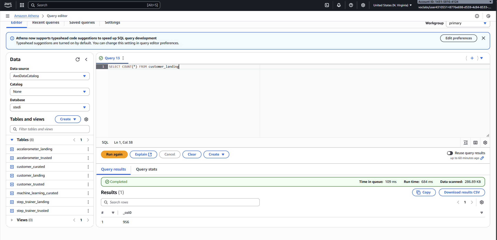
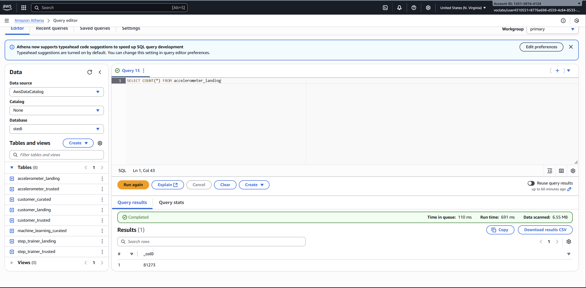
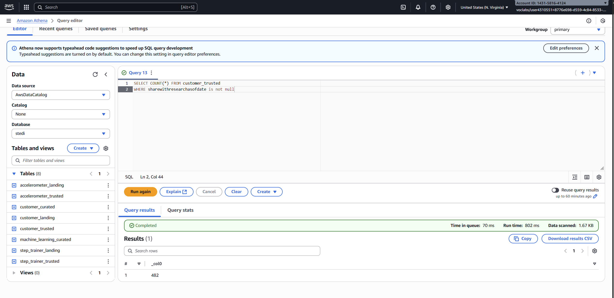

# STEDI Lakehouse Data Pipeline Project

## Overview
This project showcases a complete lakehouse architecture built in AWS to support STEDI’s data science workflows. It ingests semi-structured IoT and customer data, transforms it through multiple trust zones, and curates it for machine learning applications.

Technologies used:
- AWS Glue
- AWS S3
- AWS Athena
- Apache Spark
- Python

---

## Workflow Architecture

---

## Data Ingestion and Landing Zone Setup

- Created three S3 directories to simulate incoming data streams:
  - `customer_landing`
  - `accelerometer_landing`
  - `step_trainer_landing`
- Uploaded sample datasets to each directory.

---

## Landing Zone Exploration

- Built Glue tables using SQL scripts:
  - `customer_landing.sql`
  - `accelerometer_landing.sql`
  - `step_trainer_landing.sql`
- Queried each table using Athena to validate schema and data.

### Athena Query Results

  

---

## Trusted Zone Transformation

- Created two AWS Glue jobs:
  - `customer_trusted`: Filtered customers who consented to data sharing.
  - `accelerometer_trusted`: Filtered accelerometer readings from consenting customers.
- Verified results using Athena.

### Athena Query Result

---

## Curated Zone Construction

- Identified a data quality issue with duplicate serial numbers.
- Created `customers_curated` Glue job:
  - Included only customers with valid accelerometer data and consent.
  - Ensured correct serial number alignment with IoT records.

---

## Glue Studio Jobs for Final Integration

- Built two Glue Studio jobs:
  1. `step_trainer_trusted`: Filtered Step Trainer records for curated customers.
  2. `machine_learning_curated`: Aggregated Step Trainer and Accelerometer readings by timestamp.

---

## Data Validation

Validated row counts at each stage:

| Zone       | Table                     | Expected Rows |
|------------|---------------------------|----------------|
| Landing    | customer                  | 956            |
|            | accelerometer             | 81,273         |
|            | step_trainer              | 28,680         |
| Trusted    | customer_trusted          | 482            |
|            | accelerometer_trusted     | 40,981         |
|            | step_trainer_trusted      | 14,460         |
| Curated    | customers_curated         | 482            |
|            | machine_learning_curated  | 43,681         |

---

## Tools & Technologies

- AWS Glue (ETL jobs, Glue Studio)
- AWS S3 (data lake storage)
- AWS Athena (SQL querying)
- Apache Spark (distributed processing)
- Python (scripted transformations)

---

## Screenshots & Artifacts

All screenshots and SQL scripts are included in the `/screenshots` and `/sql_scripts` folders respectively.

---

## Repository Structure

